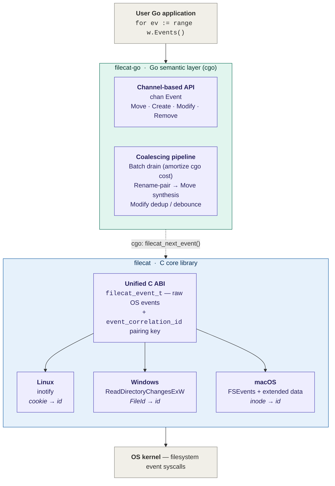

# Filecat

[](https://github.com/lizzary/Filecat/actions/workflows/ci.yml)
[](https://github.com/lizzary/Filecat/actions/workflows/sanitize.yml)
[](https://github.com/lizzary/Filecat/actions/workflows/release.yml)
[](LICENSE)

> **Two-layer file watching stack** — Filecat is the **C core**. For Go users,
> see [**filecat-go**](https://github.com/lizzary/Filecat-go), which adds
> Watchman-style event coalescing, rename → `Move` synthesis, modify debouncing,
> and an idiomatic channel-based Go API on top of this library via cgo.
>
> See [Architecture](#architecture) for the full layering.

A cross-platform C library for **recursive directory watching**, designed to
be embedded into higher-level runtimes via FFI/cgo.

## Why Filecat

Go's [`fsnotify`](https://github.com/fsnotify/fsnotify) intentionally does
not provide recursive watching, on any of its supported platforms. The
canonical workaround — walk the tree from Go and register one fsnotify
watcher per directory — pays a high price on real-world trees:

- A `map[int]string` of watch-descriptor-to-absolute-path in the Go heap,
  plus the GC overhead of keeping it live.
- One `inotify_add_watch` syscall per directory at startup, with no
  events delivered until the walk finishes.
- One Go-side watcher object per directory, with its own goroutine /
  channel plumbing depending on the wrapper.

On a `node_modules`, a monorepo, or a build cache this is the difference
between a watcher that comes up in milliseconds and one that takes
seconds-to-minutes to be ready and holds hundreds of MB to multiple GB of
RSS while doing so. See [`bench/results/`](bench/results/) for the actual
numbers on a documented baseline.

Filecat sits below that layer:

- On **Windows**, a single `ReadDirectoryChangesW` handle with
  `bWatchSubtree=TRUE` covers the entire subtree. **O(1) handles,
  O(1) cold start.**
- On **macOS**, a single `FSEvents` stream covers the entire subtree.
  **O(1) streams, O(1) cold start.**
- On **Linux**, the inotify subsystem itself does not support recursion
  — no library can change that in user space. What Filecat does change
  is the constant factor: the watch table is a flat open-addressed hash
  map in C, indexed by `wd`, holding *relative* paths only; no Go
  runtime, no GC, no per-directory allocator churn. **Still O(N)
  directories, just a much smaller N's worth.**

### Cross-platform rename pairing in a single 64-bit field

Recursive watching is half the story. The other half is *what do you do
with a rename when you get one* — every OS surfaces the two halves
differently, and most cross-platform watchers either pretend the
asymmetry doesn't exist (and break under load) or punt it to the caller
(and force every binding to re-implement the same hashmap).

Filecat puts a single `event_correlation_id` on every `filecat_event_t`,
populated from whatever native identity the kernel actually surfaces:

- **Linux** — the inotify rename cookie (non-zero on `RENAMED_OLD` /
  `RENAMED_NEW`; the two halves of one `rename(2)` share it).
- **Windows** — the NTFS / ReFS `FileId` from
  `FILE_NOTIFY_EXTENDED_INFORMATION` (non-zero on every event; rename
  pairs share it, and so does a `REMOVED + CREATED` pair from a
  cross-subdirectory move or an MFT-reused delete+create).
- **macOS** — the FSEvents extended-data inode (10.13+; non-zero on
  every event; both halves of a rename share it).

Two events with the same non-zero id refer to the same logical file or
rename — *that one rule covers all three platforms*. The inline
`filecat_event_pairable(&ev)` helper is sugar for `id != 0` so call
sites read as "pair this or pass it through":

```c
if (filecat_event_pairable(&ev)) {
    pending[ev.event_correlation_id] = ev;   /* pair on a hashmap key */
} else {
    emit(&ev);                                /* nothing to pair with */
}
```

No path-keyed identity cache to keep in sync with the file system, no
per-OS branching in the binding, no leaky `Move-or-Rename-or-Delete?`
heuristic.

### Small, embeddable C ABI

The library exposes a small C ABI (five functions plus the inline
pairing helper), so binding it from cgo (planned: [`bindings/go/`](bindings/go/),
and a higher-level `filecat-go` module on top of it), Rust FFI, or Python
`ctypes` is straightforward.

For the rationale behind the blocking-pull API, the cross-platform
correlation-id contract, the rename-event asymmetry, and the lifecycle /
cancellation model, see [`docs/DESIGN.md`](docs/DESIGN.md).

## Status

| Platform | Backend                                       | Pairing identity (`event_correlation_id`) | Status      |
|----------|-----------------------------------------------|-------------------------------------------|-------------|
| Windows  | `ReadDirectoryChangesExW` (Win 10 1709+)      | NTFS / ReFS `FileId`                      | Implemented |
| Linux    | `inotify` + `eventfd` cancel channel          | inotify rename cookie                     | Implemented |
| macOS    | `FSEvents` + extended data (macOS 10.13+)     | inode                                     | Implemented |

## Architecture

Filecat sits between OS-native filesystem event APIs and Go consumers. The C
core handles cross-platform recursive watching and emits raw events; the
[filecat-go](https://github.com/lizzary/Filecat-go) layer handles event
coalescing and exposes a Go-idiomatic channel API.



The boundary between the two layers is intentional: OS-specific behavior
(watch-descriptor lifecycle, queue-overflow recovery, the native flag /
inode / FileId / cookie zoo) stays in the C core where the platform APIs
live, while batch coalescing and rename → `Move` synthesis happen in the
Go layer where GC, maps, and goroutines make them cheap to express.

The pivot that makes the boundary clean is **`event_correlation_id`**:
each backend funnels its native pairing key into the same 64-bit field,
so the Go-side rename-pair → `Move` synthesis collapses to a single
hashmap keyed on that field — no per-OS branching above the cgo wall,
no path-based identity cache, no leaky `Move-or-Rename` heuristic.

## Usage

```c
#include <filecat/filecat.h>
#include <inttypes.h>
#include <stdio.h>

int main(void) {
    filecat_watcher_t *w;
    filecat_status_t s = filecat_open("C:/some/dir", /*recursive=*/1, &w);
    if (s != FILECAT_OK) {
        fprintf(stderr, "open: %s\n", filecat_strerror(s));
        return 1;
    }

    filecat_event_t ev;
    while ((s = filecat_next_event(w, &ev)) == FILECAT_OK) {
        /* event_correlation_id is the cross-platform pairing key:
         * any two events sharing a non-zero id refer to the same
         * logical file / rename. filecat_event_pairable is sugar
         * for (ev.event_correlation_id != 0). */
        if (filecat_event_pairable(&ev)) {
            printf("event=%d path=%s id=0x%016" PRIx64 "\n",
                   (int)ev.type, ev.path, ev.event_correlation_id);
        } else {
            printf("event=%d path=%s id=-\n", (int)ev.type, ev.path);
        }
    }

    filecat_close(w);
    return 0;
}
```

`filecat_next_event` is **blocking and single-threaded**. The string in
`ev.path` is owned by the watcher and remains valid only until the next call
to `filecat_next_event` or `filecat_close`.

`recursive` maps to Windows' `bWatchSubtree`: pass `0` to watch only the
target directory; non-zero to watch all descendants.

`ev.path` is relative to the directory passed to `filecat_open`. Callers that
need absolute paths should join the watch root with `ev.path` themselves
(and copy, since `ev.path` is invalidated by the next call).

### Pairing renames and moves

The typical use of `event_correlation_id` is buffering pairable events
in a short-lived hashmap and flushing them as logical `Move` events when
the second half arrives:

```c
filecat_event_t ev;
while (filecat_next_event(w, &ev) == FILECAT_OK) {
    if (!filecat_event_pairable(&ev)) {
        emit_raw(&ev);                                 /* nothing to pair */
        continue;
    }
    filecat_event_t *mate = map_pop(pending, ev.event_correlation_id);
    if (mate) emit_move(mate, &ev);                    /* both halves arrived */
    else      map_put(pending, ev.event_correlation_id, copy_of(&ev));
}
```

Per-platform: on Linux only `RENAMED_OLD` / `RENAMED_NEW` carry an id, so
the helper returns 0 for plain create / modify / remove events and they
fall straight through. On Windows and macOS every event for a real file
has an id, so the same hashmap also catches `REMOVED + CREATED` pairs
that share a `FileId` — exactly how cross-subdirectory moves and
MFT-reused delete-then-create patterns surface there. See
[`docs/DESIGN.md` §2.4](docs/DESIGN.md) for the full contract.

### Windows long paths

The Windows backend internally normalizes inputs with `GetFullPathNameW` and
prepends `\\?\` (or `\\?\UNC\` for UNC paths), so directories whose absolute
paths exceed `MAX_PATH` (260) are accepted without requiring the system-wide
`LongPathsEnabled` registry setting. Paths the caller has already prefixed
with `\\?\` or `\\.\` are passed through unchanged.

## Per-platform event matrix

The exhaustive map of *what the user does* → *what the OS emits* → *what
Filecat emits*. Use it as a reference when wiring downstream logic. Event
names are abbreviated (`ADDED` = `FILE_ACTION_ADDED`, `IN_CREATE` keeps
the inotify prefix, `ItemCreated` = `kFSEventStreamEventFlagItemCreated`,
etc.); the `id` annotation flags non-default `event_correlation_id`
behavior.

| User action | OS-native events | Filecat events |
|---|---|---|
| **① Create file** (`touch` / `fopen("w")`) | | |
| &nbsp;&nbsp;Windows | `ADDED` | `CREATED` |
| &nbsp;&nbsp;Linux | `IN_CREATE` | `CREATED` (id=0) |
| &nbsp;&nbsp;macOS | `ItemCreated` (may coalesce `\|ItemModified`) | `CREATED` (falls back to `MODIFIED` when both flags set; see §3.3) |
| **② Write file content** | | |
| &nbsp;&nbsp;Windows | `MODIFIED`, often ×N (size / last-write / attrs each fire) | `MODIFIED` × N |
| &nbsp;&nbsp;Linux | `IN_MODIFY` | `MODIFIED` (id=0) |
| &nbsp;&nbsp;macOS | `ItemModified` | `MODIFIED` |
| **③ Change attributes** (`chmod` / `SetFileAttributes`) | | |
| &nbsp;&nbsp;Windows | `MODIFIED` (attrs filter) | `MODIFIED` |
| &nbsp;&nbsp;Linux | `IN_ATTRIB` | `MODIFIED` (id=0) |
| &nbsp;&nbsp;macOS | `ItemInodeMetaMod` / `XattrMod` / `FinderInfoMod` / `ChangeOwner` | `MODIFIED` |
| **④ Delete file** (`unlink`) | | |
| &nbsp;&nbsp;Windows | `REMOVED` | `REMOVED` |
| &nbsp;&nbsp;Linux | `IN_DELETE` | `REMOVED` (id=0) |
| &nbsp;&nbsp;macOS | `ItemRemoved` | `REMOVED` |
| **⑤ Rename file, same parent** (`mv a b`) | | |
| &nbsp;&nbsp;Windows | `RENAMED_OLD_NAME(a)` + `RENAMED_NEW_NAME(b)`, shared `FileId` | `RENAMED_OLD(a)` + `RENAMED_NEW(b)`, **same id** |
| &nbsp;&nbsp;Linux | `IN_MOVED_FROM(a,cookie)` + `IN_MOVED_TO(b,cookie)` | `RENAMED_OLD(a)` + `RENAMED_NEW(b)`, **same id** |
| &nbsp;&nbsp;macOS | `ItemRenamed(a)` + `ItemRenamed(b)`, shared inode (no OLD/NEW hint) | `RENAMED_OLD(a)` + **`RENAMED_OLD(b)`**, **same id** |
| **⑥ Move file across subdirs** (`mv a/x b/x`, both inside watch) | | |
| &nbsp;&nbsp;Windows | `REMOVED(a/x)` + `ADDED(b/x)`, shared `FileId` (**not** `RENAMED_*` — that's only for same-parent) | `REMOVED(a/x)` + `CREATED(b/x)`, **same id** |
| &nbsp;&nbsp;Linux | `IN_MOVED_FROM(a/x,cookie)` on wd_a + `IN_MOVED_TO(b/x,cookie)` on wd_b | `RENAMED_OLD(a/x)` + `RENAMED_NEW(b/x)`, **same id** |
| &nbsp;&nbsp;macOS | `ItemRenamed(a/x)` + `ItemRenamed(b/x)`, shared inode | `RENAMED_OLD(a/x)` + `RENAMED_OLD(b/x)`, **same id** |
| **⑦ Move OUT of watch** (half-move, destination outside) | | |
| &nbsp;&nbsp;Windows | `REMOVED(a)` (destination invisible) | `REMOVED(a)` |
| &nbsp;&nbsp;Linux | `IN_MOVED_FROM(a,cookie)`, no mate | `RENAMED_OLD(a)`, **id non-zero, mate never arrives** |
| &nbsp;&nbsp;macOS | `ItemRenamed(a)` (source side only) | `RENAMED_OLD(a)` |
| **⑧ Move INTO watch** (half-move, source outside) | | |
| &nbsp;&nbsp;Windows | `ADDED(a)` (looks like a create) | `CREATED(a)` |
| &nbsp;&nbsp;Linux | `IN_MOVED_TO(a,cookie)`, no mate | `RENAMED_NEW(a)`, **id non-zero, mate never arrives** |
| &nbsp;&nbsp;macOS | `ItemRenamed(a)` (destination side only) | `RENAMED_OLD(a)` |
| **⑨ Atomic replace** (`mv a b`, b already exists) | | |
| &nbsp;&nbsp;Windows | `RENAMED_OLD_NAME(a)` + `RENAMED_NEW_NAME(b)` (original b silently overwritten) | `RENAMED_OLD(a)` + `RENAMED_NEW(b)`, **same id** |
| &nbsp;&nbsp;Linux | `IN_MOVED_FROM(a,cookie)` + `IN_MOVED_TO(b,cookie)` (original b's inode silently freed) | `RENAMED_OLD(a)` + `RENAMED_NEW(b)`, **same id** |
| &nbsp;&nbsp;macOS | `ItemRenamed(a)` + `ItemRenamed(b)`, shared new inode | `RENAMED_OLD(a)` + `RENAMED_OLD(b)`, **same id** |
| **⑩ Create directory** (`mkdir`) | | |
| &nbsp;&nbsp;Windows | `ADDED` (subtree handle auto-covers new dir) | `CREATED` |
| &nbsp;&nbsp;Linux | `IN_CREATE \| IN_ISDIR` | `CREATED` (id=0); **library installs watch on the new subtree** |
| &nbsp;&nbsp;macOS | `ItemCreated \| ItemIsDir` (stream auto-covers) | `CREATED` |
| **⑪ Delete directory** (`rmdir`) | | |
| &nbsp;&nbsp;Windows | `REMOVED` | `REMOVED` |
| &nbsp;&nbsp;Linux | parent: `IN_DELETE \| IN_ISDIR`; the dir's own wd: `IN_DELETE_SELF` + `IN_IGNORED` | `REMOVED` (id=0); library swallows SELF / IGNORED and cleans wd map |
| &nbsp;&nbsp;macOS | `ItemRemoved \| ItemIsDir` | `REMOVED` |
| **⑫ Rename directory, same parent** (`mv a b`) | | |
| &nbsp;&nbsp;Windows | `RENAMED_OLD_NAME(a)` + `RENAMED_NEW_NAME(b)`, shared `FileId` | `RENAMED_OLD(a)` + `RENAMED_NEW(b)`, **same id** |
| &nbsp;&nbsp;Linux | `IN_MOVED_FROM(a,cookie,ISDIR)` + `IN_MOVED_TO(b,cookie,ISDIR)` | `RENAMED_OLD(a)` + `RENAMED_NEW(b)`, **same id**; library re-keys the wd map under the new name |
| &nbsp;&nbsp;macOS | `ItemRenamed(a)` + `ItemRenamed(b)`, shared inode | `RENAMED_OLD(a)` + `RENAMED_OLD(b)`, **same id** |
| **⑬ Move directory across subdirs** (`mv a/sub b/sub`) | | |
| &nbsp;&nbsp;Windows | `REMOVED(a/sub)` + `ADDED(b/sub)`, shared `FileId` | `REMOVED(a/sub)` + `CREATED(b/sub)`, **same id** |
| &nbsp;&nbsp;Linux | `IN_MOVED_FROM(a/sub,cookie)` on wd_a + `IN_MOVED_TO(b/sub,cookie)` on wd_b | `RENAMED_OLD(a/sub)` + `RENAMED_NEW(b/sub)`, **same id**; library re-wires the subtree's watches |
| &nbsp;&nbsp;macOS | `ItemRenamed(a/sub)` + `ItemRenamed(b/sub)`, shared inode | `RENAMED_OLD(a/sub)` + `RENAMED_OLD(b/sub)`, **same id** |
| **⑭ Directory moved OUT of watch** (half-move out) | | |
| &nbsp;&nbsp;Windows | `REMOVED(a/sub)` | `REMOVED(a/sub)` |
| &nbsp;&nbsp;Linux | `IN_MOVED_FROM(a/sub,cookie,ISDIR)` + later `IN_IGNORED` for each descendant wd | `RENAMED_OLD(a/sub)`, **id non-zero, no mate**; library recursively `inotify_rm_watch`'s the subtree |
| &nbsp;&nbsp;macOS | `ItemRenamed(a/sub)` | `RENAMED_OLD(a/sub)` |
| **⑮ Directory moved INTO watch** (half-move in, may carry pre-existing contents) | | |
| &nbsp;&nbsp;Windows | `ADDED(a/sub)`; subtree handle auto-covers descendants for *future* activity | `CREATED(a/sub)`; future fs activity inside flows normally |
| &nbsp;&nbsp;Linux | `IN_MOVED_TO(a/sub,cookie,ISDIR)`; **the kernel does NOT auto-watch descendants** | `RENAMED_NEW(a/sub)`, **id non-zero, no mate**; **library walks the moved-in subtree and `inotify_add_watch`'s every directory**. Pre-existing contents do NOT replay as CREATED; future activity inside flows normally. |
| &nbsp;&nbsp;macOS | `ItemRenamed(a/sub)`; stream auto-covers descendants | `RENAMED_OLD(a/sub)`; future activity inside flows normally |

### Cross-cutting observations

- **Two-event move = same id, three platforms** (rows ⑤⑥⑨⑫⑬). This is
  the cross-platform contract that `event_correlation_id` exists to
  provide.
- **Half-moves are single events** (rows ⑦⑧⑭⑮). The id is set on Linux
  (cookie) and on Win/macOS (FileId / inode), but no second event ever
  arrives — downstream pairing maps must flush stale entries after a
  timeout.
- **Linux fs side-effects** in rows ⑩⑬⑮: every new or moved-in
  directory triggers a library-side recursive walk + `inotify_add_watch`
  pass. The unavoidable cost of inotify not being recursive.
- **macOS quirk**: every rename half is reported as `RENAMED_OLD` — no
  `RENAMED_NEW` ever fires on macOS. Pairing by id is unaffected;
  type-based branching needs to know this.
- **Windows surprises**: same-parent rename → `RENAMED_*`, cross-parent
  move → `REMOVED + ADDED` (rows ⑤ vs ⑥) — same shared `FileId` either
  way. A single content write often produces multiple `MODIFIED` events
  (size / last-write / attrs each one); deduplication is the consumer's
  job.

## Build

Pure CMake, no external dependencies. The library, the example CLI, and the
test suite all build out of the same tree.

### Quick start

```bash
cmake -B build -DCMAKE_BUILD_TYPE=Release
cmake --build build
ctest --test-dir build --output-on-failure
```

### Per-platform commands

**Windows (MinGW):**

```bash
cmake -B build -G "MinGW Makefiles" -DCMAKE_BUILD_TYPE=Release
cmake --build build -j
```

**Windows (Visual Studio / MSVC):** multi-config generator, pass `--config`:

```powershell
cmake -B build -G "Visual Studio 17 2022" -A x64
cmake --build build --config Release
ctest --test-dir build -C Release --output-on-failure
```

Artifacts land under `build/Release/` instead of `build/`.

**Linux:**

```bash
cmake -B build -DCMAKE_BUILD_TYPE=Release
cmake --build build -j
```

**macOS:** the `APPLE` branch is detected automatically and `-framework
CoreServices` is linked for FSEvents — no extra flags.

```bash
cmake -B build -DCMAKE_BUILD_TYPE=Release
cmake --build build -j
```

### Build outputs

In `build/` (or `build/Release/` on MSVC):

| File | What it is |
|---|---|
| `libfilecat.a` / `filecat.lib` | the static library |
| `filecat-watch` / `.exe`       | demo CLI; usage below |
| `test_correctness` / `.exe`    | public-API correctness suite |
| `test_stress` / `.exe`         | moderate sustained stress |
| `test_high_load` / `.exe`      | extreme load + overflow recovery + 5s soak |

### CMake options

| Option | Default | Effect |
|---|---|---|
| `FILECAT_BUILD_EXAMPLES` | `ON` | build `filecat-watch` |
| `FILECAT_BUILD_TESTS`    | `ON` | build the three test executables |
| `CMAKE_BUILD_TYPE`       | (none) | `Debug`, `Release`, `RelWithDebInfo`, `MinSizeRel` |

Library-only build:

```bash
cmake -B build -DFILECAT_BUILD_EXAMPLES=OFF -DFILECAT_BUILD_TESTS=OFF
cmake --build build
```

Out-of-source builds are encouraged — multiple build directories
(`build-debug/`, `build-release/`, `build-asan/`) can coexist.

ASan/UBSan (POSIX only):

```bash
cmake -B build-asan -DCMAKE_BUILD_TYPE=Debug \
    -DCMAKE_C_FLAGS="-fsanitize=address,undefined"
cmake --build build-asan
ctest --test-dir build-asan --output-on-failure
```

## Tests

The test suite is cross-platform: the same `test_correctness`,
`test_stress`, and `test_high_load` executables run on Linux, macOS, and
Windows. Helpers absorb the platform-specific bits (path separator,
threading primitives, rename-event pairing semantics).

Run everything via `ctest`:

```bash
ctest --test-dir build --output-on-failure
```

Run one suite:

```bash
ctest --test-dir build -R test_correctness --output-on-failure
```

Or invoke the binaries directly for per-test detail:

```bash
./build/test_correctness          # POSIX
./build/test_correctness.exe      # Windows MinGW
./build/Release/test_correctness.exe   # Windows MSVC
```

CTest enforces per-suite timeouts (30 s / 60 s / 90 s, see
[CMakeLists.txt](CMakeLists.txt)) and will kill a hung run rather than
let CI stall.

## Benchmarks

Four reproducible micro-benchmarks live in [bench/](bench/), built only
when explicitly requested (off by default):

```bash
cmake -B build -DCMAKE_BUILD_TYPE=Release -DFILECAT_BUILD_BENCH=ON
cmake --build build -j
bench/run.sh                        # or invoke the binaries individually
```

| Binary             | What it measures                                                                  |
|--------------------|-----------------------------------------------------------------------------------|
| `bench_throughput` | events drained per second under 4 producer threads × 10 s sustained load          |
| `bench_latency`    | end-to-end touch → event latency over 5000 samples, min/p50/p90/p99/p999/max      |
| `bench_rss`        | resident set size delta when opening a recursive watcher over N subdirectories    |
| `bench_open`       | `filecat_open` cold-start time vs subtree size (median of 3 trials)               |

### Latest results

Full data + per-platform commentary live in
[bench/results/](bench/results/README.md). Two highlights from the first
runs:

**Linux** — Intel Xeon Gold 6144 @ 3.5 GHz (ESXi VM, 12 vCPU):

| Metric                              | Result          |
|-------------------------------------|-----------------|
| Sustained throughput                | 84.9 k events/s, 0 overflows |
| Touch → event latency p50 / p99     | 37 µs / 75 µs    |
| `filecat_open`, recursive N=10000   | 107 ms (linear) |

**Windows** — `filecat_open` for a recursive watch (single
`CreateFileW` + `ReadDirectoryChangesW(bWatchSubtree=TRUE)`):

| N            | `filecat_open` |
|--------------|----------------|
| 0            | 0.032 ms       |
| 10           | 0.040 ms       |
| 10000        | 0.066 ms       |

That 107 ms vs 0.066 ms at N=10000 is the **~1600× platform-asymmetry
datapoint** — and it's architectural, not implementation. inotify
has no recursive mode at the kernel layer, so this gap is the cost any
inotify-based library pays on Linux. Filecat's contribution is using
the *most native* mechanism on each platform rather than emulating one
worldview everywhere.

### Caveats

- `bench_rss` and `bench_open` are designed to expose platform asymmetry:
  Linux registers one inotify watch per directory (O(N) memory and time),
  while Windows/macOS use a single handle/stream (O(1)). The headline
  story here is *shape*, not absolute KB or ms.
- Latency p99 is sensitive to scheduler noise. For publishable numbers,
  pin the binary (`taskset -c 0` on Linux), disable Turbo Boost, and
  build with `-DCMAKE_BUILD_TYPE=Release` (never with sanitizers on).
- On Linux, `bench_rss` and `bench_open` honor `fs.inotify.max_user_watches`;
  the backend is best-effort, so values above the cap will print but won't
  reflect a fully-watched tree.

## Demo

`filecat-watch` is a short CLI built from
[examples/watch.c](examples/watch.c) — useful for smoke-testing the
library against a real directory. It prints one line per event with the
`event_correlation_id` formatted as a hex id (or `-` when the backend did
not surface one):

```bash
./build/filecat-watch /some/dir 1          # POSIX
./build/filecat-watch.exe C:/some/dir 1    # Windows
```

The second argument is the `recursive` flag (`0` or `1`). Ctrl+C exits.

## License

MIT — see [LICENSE](LICENSE).
