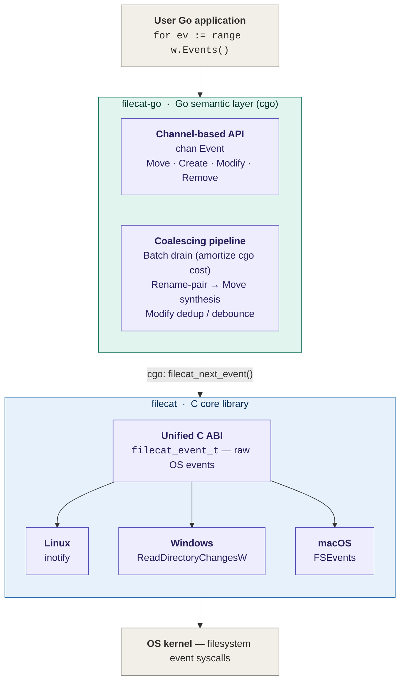

# Filecat

[](https://github.com/lizzary/Filecat/actions/workflows/ci.yml)
[](https://github.com/lizzary/Filecat/actions/workflows/sanitize.yml)
[](https://github.com/lizzary/Filecat/actions/workflows/release.yml)
[](LICENSE)

> **Two-layer file watching stack** — Filecat is the **C core**. For Go users,
> see [**filecat-go**](https://github.com/lizzary/Filecat-go), which adds
> Watchman-style event coalescing, rename → `Move` synthesis, modify debouncing,
> and an idiomatic channel-based Go API on top of this library via cgo.
>
> See [Architecture](#architecture) for the full layering.

A cross-platform C library for **recursive directory watching**, designed to
be embedded into higher-level runtimes via FFI/cgo.

## Why Filecat

Go's [`fsnotify`](https://github.com/fsnotify/fsnotify) intentionally does
not provide recursive watching, on any of its supported platforms. The
canonical workaround — walk the tree from Go and register one fsnotify
watcher per directory — pays a high price on real-world trees:

- A `map[int]string` of watch-descriptor-to-absolute-path in the Go heap,
  plus the GC overhead of keeping it live.
- One `inotify_add_watch` syscall per directory at startup, with no
  events delivered until the walk finishes.
- One Go-side watcher object per directory, with its own goroutine /
  channel plumbing depending on the wrapper.

On a `node_modules`, a monorepo, or a build cache this is the difference
between a watcher that comes up in milliseconds and one that takes
seconds-to-minutes to be ready and holds hundreds of MB to multiple GB of
RSS while doing so. See [`bench/results/`](bench/results/) for the actual
numbers on a documented baseline.

Filecat sits below that layer:

- On **Windows**, a single `ReadDirectoryChangesW` handle with
  `bWatchSubtree=TRUE` covers the entire subtree. **O(1) handles,
  O(1) cold start.**
- On **macOS**, a single `FSEvents` stream covers the entire subtree.
  **O(1) streams, O(1) cold start.**
- On **Linux**, the inotify subsystem itself does not support recursion
  — no library can change that in user space. What Filecat does change
  is the constant factor: the watch table is a flat open-addressed hash
  map in C, indexed by `wd`, holding *relative* paths only; no Go
  runtime, no GC, no per-directory allocator churn. **Still O(N)
  directories, just a much smaller N's worth.**

The library exposes a single C ABI of seven functions, so binding it
from cgo (planned: [`bindings/go/`](bindings/go/), and a higher-level
`filecat-go` module on top of it), Rust FFI, or Python `ctypes` is
straightforward.

For the rationale behind the blocking-pull API, the rename-event
asymmetry across platforms, and the lifecycle / cancellation model, see
[`docs/DESIGN.md`](docs/DESIGN.md).

## Status

| Platform | Backend                 | Status        |
|----------|-------------------------|---------------|
| Windows  | `ReadDirectoryChangesW` | Implemented   |
| Linux    | `inotify`               | Implemented   |
| macOS    | `FSEvents`              | Implemented   |

## Architecture

Filecat sits between OS-native filesystem event APIs and Go consumers. The C
core handles cross-platform recursive watching and emits raw events; the
[filecat-go](https://github.com/lizzary/Filecat-go) layer handles event
coalescing and exposes a Go-idiomatic channel API.



The boundary between the two layers is intentional: OS-specific behavior
(rename-event pairing semantics, watch-descriptor lifecycle, queue-overflow
recovery) stays in the C core where the platform APIs live, while batch
coalescing and rename → `Move` synthesis happen in the Go layer where GC,
maps, and goroutines make them cheap to express.

## Usage

```c
#include <filecat/filecat.h>
#include <stdio.h>

int main(void) {
    filecat_watcher_t *w;
    filecat_status_t s = filecat_open("C:/some/dir", /*recursive=*/1, &w);
    if (s != FILECAT_OK) {
        fprintf(stderr, "open: %s\n", filecat_strerror(s));
        return 1;
    }

    filecat_event_t ev;
    while ((s = filecat_next_event(w, &ev)) == FILECAT_OK) {
        printf("event=%d path=%s\n", (int)ev.type, ev.path);
    }

    filecat_close(w);
    return 0;
}
```

`filecat_next_event` is **blocking and single-threaded**. The string in
`ev.path` is owned by the watcher and remains valid only until the next call
to `filecat_next_event` or `filecat_close`.

`recursive` maps to Windows' `bWatchSubtree`: pass `0` to watch only the
target directory; non-zero to watch all descendants.

`ev.path` is relative to the directory passed to filecat_open. Callers that 
need absolute paths should join the watch root with `ev.path` themselves 
(and copy, since `ev.path` is invalidated by the next call).

### Windows long paths

The Windows backend internally normalizes inputs with `GetFullPathNameW` and
prepends `\\?\` (or `\\?\UNC\` for UNC paths), so directories whose absolute
paths exceed `MAX_PATH` (260) are accepted without requiring the system-wide
`LongPathsEnabled` registry setting. Paths the caller has already prefixed
with `\\?\` or `\\.\` are passed through unchanged.

## Build

Pure CMake, no external dependencies. The library, the example CLI, and the
test suite all build out of the same tree.

### Quick start

```bash
cmake -B build -DCMAKE_BUILD_TYPE=Release
cmake --build build
ctest --test-dir build --output-on-failure
```

### Per-platform commands

**Windows (MinGW):**

```bash
cmake -B build -G "MinGW Makefiles" -DCMAKE_BUILD_TYPE=Release
cmake --build build -j
```

**Windows (Visual Studio / MSVC):** multi-config generator, pass `--config`:

```powershell
cmake -B build -G "Visual Studio 17 2022" -A x64
cmake --build build --config Release
ctest --test-dir build -C Release --output-on-failure
```

Artifacts land under `build/Release/` instead of `build/`.

**Linux:**

```bash
cmake -B build -DCMAKE_BUILD_TYPE=Release
cmake --build build -j
```

**macOS:** the `APPLE` branch is detected automatically and `-framework
CoreServices` is linked for FSEvents — no extra flags.

```bash
cmake -B build -DCMAKE_BUILD_TYPE=Release
cmake --build build -j
```

### Build outputs

In `build/` (or `build/Release/` on MSVC):

| File | What it is |
|---|---|
| `libfilecat.a` / `filecat.lib` | the static library |
| `filecat-watch` / `.exe`       | demo CLI; usage below |
| `test_correctness` / `.exe`    | public-API correctness suite |
| `test_stress` / `.exe`         | moderate sustained stress |
| `test_high_load` / `.exe`      | extreme load + overflow recovery + 5s soak |

### CMake options

| Option | Default | Effect |
|---|---|---|
| `FILECAT_BUILD_EXAMPLES` | `ON` | build `filecat-watch` |
| `FILECAT_BUILD_TESTS`    | `ON` | build the three test executables |
| `CMAKE_BUILD_TYPE`       | (none) | `Debug`, `Release`, `RelWithDebInfo`, `MinSizeRel` |

Library-only build:

```bash
cmake -B build -DFILECAT_BUILD_EXAMPLES=OFF -DFILECAT_BUILD_TESTS=OFF
cmake --build build
```

Out-of-source builds are encouraged — multiple build directories
(`build-debug/`, `build-release/`, `build-asan/`) can coexist.

ASan/UBSan (POSIX only):

```bash
cmake -B build-asan -DCMAKE_BUILD_TYPE=Debug \
    -DCMAKE_C_FLAGS="-fsanitize=address,undefined"
cmake --build build-asan
ctest --test-dir build-asan --output-on-failure
```

## Tests

The test suite is cross-platform: the same `test_correctness`,
`test_stress`, and `test_high_load` executables run on Linux, macOS, and
Windows. Helpers absorb the platform-specific bits (path separator,
threading primitives, rename-event pairing semantics).

Run everything via `ctest`:

```bash
ctest --test-dir build --output-on-failure
```

Run one suite:

```bash
ctest --test-dir build -R test_correctness --output-on-failure
```

Or invoke the binaries directly for per-test detail:

```bash
./build/test_correctness          # POSIX
./build/test_correctness.exe      # Windows MinGW
./build/Release/test_correctness.exe   # Windows MSVC
```

CTest enforces per-suite timeouts (30 s / 60 s / 90 s, see
[CMakeLists.txt](CMakeLists.txt)) and will kill a hung run rather than
let CI stall.

## Benchmarks

Four reproducible micro-benchmarks live in [bench/](bench/), built only
when explicitly requested (off by default):

```bash
cmake -B build -DCMAKE_BUILD_TYPE=Release -DFILECAT_BUILD_BENCH=ON
cmake --build build -j
bench/run.sh                        # or invoke the binaries individually
```

| Binary             | What it measures                                                                  |
|--------------------|-----------------------------------------------------------------------------------|
| `bench_throughput` | events drained per second under 4 producer threads × 10 s sustained load          |
| `bench_latency`    | end-to-end touch → event latency over 5000 samples, min/p50/p90/p99/p999/max      |
| `bench_rss`        | resident set size delta when opening a recursive watcher over N subdirectories    |
| `bench_open`       | `filecat_open` cold-start time vs subtree size (median of 3 trials)               |

### Latest results

Full data + per-platform commentary live in
[bench/results/](bench/results/README.md). Two highlights from the first
runs:

**Linux** — Intel Xeon Gold 6144 @ 3.5 GHz (ESXi VM, 12 vCPU):

| Metric                              | Result          |
|-------------------------------------|-----------------|
| Sustained throughput                | 84.9 k events/s, 0 overflows |
| Touch → event latency p50 / p99     | 37 µs / 75 µs    |
| `filecat_open`, recursive N=10000   | 107 ms (linear) |

**Windows** — `filecat_open` for a recursive watch (single
`CreateFileW` + `ReadDirectoryChangesW(bWatchSubtree=TRUE)`):

| N            | `filecat_open` |
|--------------|----------------|
| 0            | 0.032 ms       |
| 10           | 0.040 ms       |
| 10000        | 0.066 ms       |

That 107 ms vs 0.066 ms at N=10000 is the **~1600× platform-asymmetry
datapoint** — and it's architectural, not implementation. inotify
has no recursive mode at the kernel layer, so this gap is the cost any
inotify-based library pays on Linux. Filecat's contribution is using
the *most native* mechanism on each platform rather than emulating one
worldview everywhere.

### Caveats

- `bench_rss` and `bench_open` are designed to expose platform asymmetry:
  Linux registers one inotify watch per directory (O(N) memory and time),
  while Windows/macOS use a single handle/stream (O(1)). The headline
  story here is *shape*, not absolute KB or ms.
- Latency p99 is sensitive to scheduler noise. For publishable numbers,
  pin the binary (`taskset -c 0` on Linux), disable Turbo Boost, and
  build with `-DCMAKE_BUILD_TYPE=Release` (never with sanitizers on).
- On Linux, `bench_rss` and `bench_open` honor `fs.inotify.max_user_watches`;
  the backend is best-effort, so values above the cap will print but won't
  reflect a fully-watched tree.

## Demo

`filecat-watch` is a 70-line CLI built from
[examples/watch.c](examples/watch.c) — useful for smoke-testing the
library against a real directory:

```bash
./build/filecat-watch /some/dir 1          # POSIX
./build/filecat-watch.exe C:/some/dir 1    # Windows
```

The second argument is the `recursive` flag (`0` or `1`). Ctrl+C exits.

## License

MIT — see [LICENSE](LICENSE).
